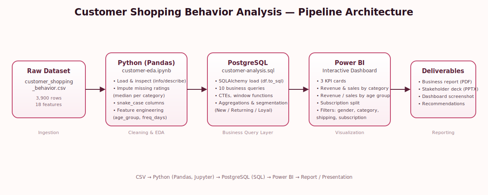

# 🛍️ Customer Shopping Behavior Analysis
### End-to-End Data Analytics Pipeline — Python · PostgreSQL · Power BI


---

## 📌 Overview

This project delivers an **end-to-end analytics workflow** on a retail dataset of **3,900 customer transactions**. Raw data is cleaned and feature-engineered in **Python**, loaded into a **PostgreSQL** database for structured business-question analysis using **SQL**, and finally visualized in an **interactive Power BI dashboard**. Findings are packaged into a formal business report and a stakeholder-ready presentation.

The goal: uncover actionable insights into customer spending patterns, product performance, discount behavior, and subscription value — and turn them into concrete business recommendations.

---

## 🏗️ Architecture / Pipeline



```
CSV Dataset  →  Python (Pandas / Jupyter)  →  PostgreSQL (SQL)  →  Power BI Dashboard  →  Report & Presentation
```

| Stage | Tool | What Happens |
|---|---|---|
| 1. Ingestion | Pandas | Load raw CSV, initial inspection (`.info()`, `.describe()`) |
| 2. Cleaning & Feature Engineering | Pandas | Impute missing ratings, standardize column names, engineer new features |
| 3. Storage | PostgreSQL + SQLAlchemy | Push cleaned DataFrame into a Postgres table for SQL-based analysis |
| 4. Business Analysis | SQL | 10 targeted business questions using aggregations, CTEs, and window functions |
| 5. Visualization | Power BI | Interactive dashboard with KPIs, filters, and cross-highlighting |
| 6. Reporting | Report + Slide Deck | Summarized findings and recommendations for stakeholders |

---

## 📊 Dataset

- **Rows:** 3,900 purchase records
- **Columns:** 18 raw features (19 after feature engineering)
- **Missing data:** 37 null values in `Review Rating`
- **Feature groups:**
  - **Demographics:** Age, Gender, Location, Subscription Status
  - **Purchase details:** Item Purchased, Category, Purchase Amount, Season, Size, Color
  - **Behavior:** Discount Applied, Promo Code Used, Previous Purchases, Frequency of Purchases, Review Rating, Shipping Type, Payment Method

---

## 🧹 Data Preparation (Python — `customer-eda.ipynb`)

- Loaded the dataset with **pandas** and profiled it with `df.info()` / `df.describe()`
- Imputed missing `review_rating` values using the **median rating per product category**
- Standardized all column names to `snake_case`
- Engineered new features:
  - `age_group` — binned customer age into segments (Young Adult, Adult, Middle-aged, Senior)
  - `purchase_frequency_days` — numeric conversion of the purchase-frequency text field
- Checked `discount_applied` vs `promo_code_used` for redundancy and dropped the duplicate column
- Loaded the cleaned DataFrame into **PostgreSQL** via `SQLAlchemy` (`df.to_sql`)

## 🗄️ Business Analysis in SQL (`customer-analysis.sql`)

Ten business questions were answered directly in PostgreSQL, including:

1. Revenue generated by male vs. female customers
2. Customers who used a discount but still spent above the average purchase amount
3. Top 5 products by average review rating
4. Standard vs. Express shipping — average purchase amount comparison
5. Subscriber vs. non-subscriber spend and revenue contribution
6. Top 5 products by discount-usage rate
7. Customer segmentation (New / Returning / Loyal) via `CASE` logic
8. Top 3 best-selling products per category (`ROW_NUMBER()` window function)
9. Relationship between repeat purchases (>5) and subscription status
10. Revenue contribution by age group

## 📈 Power BI Dashboard

An interactive dashboard was built on top of the same cleaned dataset, featuring:

- **KPI cards:** Total customers, average purchase amount, average review rating, subscriber rate
- **Visuals:** Revenue & sales by category, revenue & sales by age group, subscription split (donut)
- **Slicers:** Gender, category, shipping type, subscription status

---

## 💡 Key Insights

- **Gender gap:** Male customers generated **$157,890** in revenue vs. **$75,191** for female customers — more than double.
- **Deal-seeker conversion:** **839 customers** used a discount yet still spent above the average purchase amount.
- **Top-rated products:** Gloves (3.86), Sandals (3.84), and Boots (3.82) lead average review ratings — overall average is 3.75.
- **Shipping premium:** Express shipping customers spend slightly more on average ($60.48) than Standard shipping customers ($58.46).
- **Subscription paradox:** Only **27%** of customers are subscribers, yet average spend is nearly identical between subscribers ($59.49) and non-subscribers ($59.87) — signaling untapped upsell potential.
- **Discount-heavy categories:** Hats, Sneakers, Coats, Sweaters, and Pants each see discount usage above ~47%.
- **Customer loyalty:** The majority of the base (**3,116 customers**) is already "Loyal"; only 83 are "New" and 701 are "Returning."
- **Age-driven revenue:** Young Adults are the highest-revenue segment at **$62,143**.

---

## 🧭 Business Recommendations

- **Boost subscriptions** — promote exclusive benefits to convert the 73% non-subscriber base.
- **Strengthen loyalty programs** — grow the Loyal segment beyond its current 3,116 customers.
- **Review discount policy** — balance sales lift against margin, given ~50% discount rates on some products.
- **Lead with top-rated products** (Gloves, Sandals, Boots) in marketing campaigns.
- **Target Young Adults and Express-shipping users** — the highest-value customer segments.

---

## 📁 Repository Structure

```
├── customer-eda.ipynb                          # Python data cleaning, EDA & PostgreSQL load
├── customer-analysis.sql                       # SQL business-question queries
├── Customer_Shopping_Behavior_Analysis-report.pdf   # Full written business report
├── Customer-Shopping-Behavior-Analysis.pptx    # Stakeholder presentation deck
├── dashboard-screenshot.png                    # Power BI dashboard preview
├── architecture-diagram.svg                    # Pipeline architecture diagram
└── README.md
```

---

## 🚀 How to Reproduce

1. Clone the repository and install dependencies:
   ```bash
   pip install pandas sqlalchemy psycopg2-binary
   ```
2. Update the PostgreSQL connection details in `customer-eda.ipynb` (username, password, host, database).
3. Run the notebook to clean the data and load it into PostgreSQL.
4. Execute the queries in `customer-analysis.sql` against the `customer` table.
5. Open the Power BI dashboard (or rebuild it by connecting Power BI to the same PostgreSQL table) to explore the visuals interactively.

---

## 🛠️ Tech Stack

`Python` · `Pandas` · `Jupyter Notebook` · `PostgreSQL` · `SQL (CTEs, Window Functions)` · `SQLAlchemy` · `Power BI`

---

## 👤 Author

Feel free to connect for feedback or collaboration opportunities.
